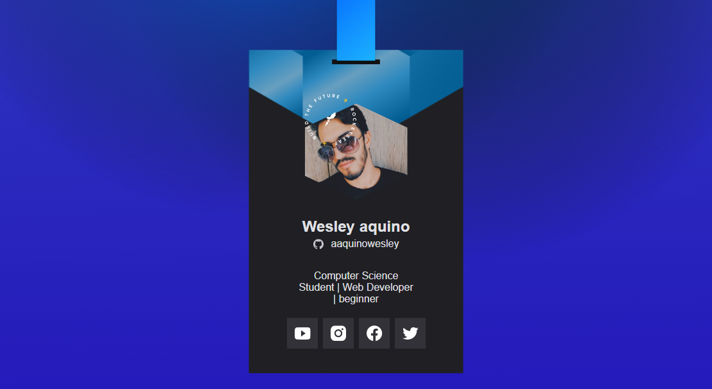
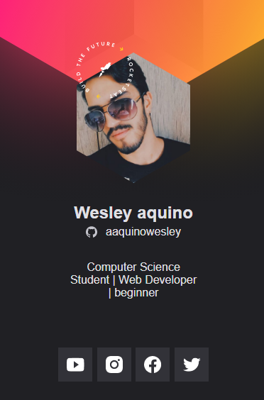

<h1 align="center"> Cracha NLW - 2021 🚀</h1>
<p align="center">  Cracha virtual criado na trilha origin na NLW Heat</p>

<p align="center"> Cracha exclusivo para uso na DoWhile 2021, criado na NLW Heat da RocketSeat.</p>

<!-- <p align='center'> → Veja como ficou o projeto <a href='https://aaquinowesley.github.io/cracha-nlw/'> aqui </a> ← </p> -->

<div align='center'>
  <div>
    <h2> Projeto desktop </h2>
    
  </div>
  <div> 
    <h2> Projeto Mobile </h2>
    
  </div>
</div>

## 🤔 Como usar ?

```
Baixe o projeto e descompacte ele
Abra a pasta do projeto em seu editor de códigos.
```
## 📝 Licença

Esse projeto está sob licença do MIT.
